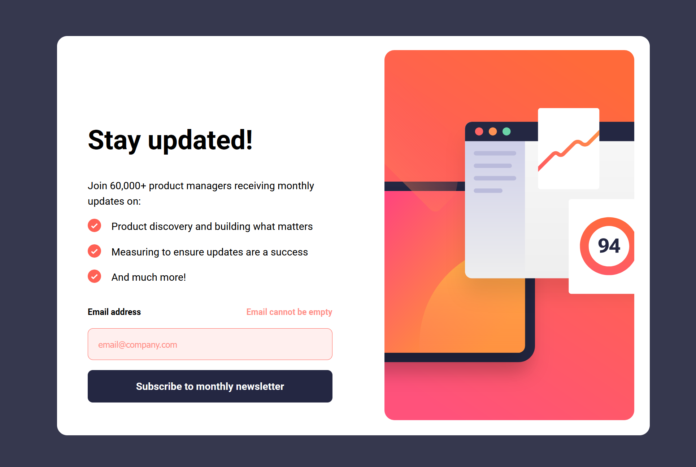

# Frontend Mentor - Newsletter sign-up form with success message solution

This is a solution to the [Newsletter sign-up form with success message challenge on Frontend Mentor](https://www.frontendmentor.io/challenges/newsletter-signup-form-with-success-message-3FC1AZbNrv). Frontend Mentor challenges help you improve your coding skills by building realistic projects.

## Table of contents

- [Overview](#overview)
  - [The challenge](#the-challenge)
  - [Screenshot](#screenshot)
- [My process](#my-process)
  - [Built with](#built-with)
  - [What I learned](#what-i-learned)
  - [Continued development](#continued-development)
  - [Useful resources](#useful-resources)
- [Author](#author)
- [Acknowledgments](#acknowledgments)

## Overview

### The challenge

Users should be able to:

- Add their email and submit the form
- See a success message with their email after successfully submitting the form
- See form validation messages if:
  - The field is left empty
  - The email address is not formatted correctly
- View the optimal layout for the interface depending on their device's screen size
- See hover and focus states for all interactive elements on the page

### Screenshot

## My process

I wanted to try my hand at using Svelte 5. I broke down each of the sections of the application into its components and then built them seperately. Using mobile first design.

### Built with

- Semantic HTML5 markup
- CSS custom properties
- Flexbox
- Mobile-first workflow
- [Svelte 5](https://svelte.dev//) - UI Framework

### What I learned

I learned how to use the Svelte runes such as $state() and $props().

### Continued development

I just want to continue using Svelte and eventualy master the framework. I really enjoyed the development process.

### Useful resources

- [Syntax: Svelte 5 Basics - Complete Svelte 5 Course for Beginners](https://youtu.be/8DQailPy3q8?si=aVzRqMIPSGzSwLE0) - This helped me learn the basics of Svelte. I really enjoyed how Scott Tolinksi presented the concepts and will continue to learn with his and Syntax.fm resources.
